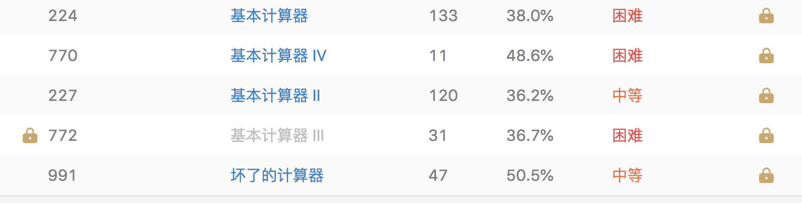

# 计算器



## [224. 基本计算器](https://leetcode-cn.com/problems/basic-calculator)

### 题目

```
实现一个基本的计算器来计算一个简单的字符串表达式的值。

字符串表达式可以包含左括号 ( ，右括号 )，加号 + ，减号 -，非负整数和空格  。

示例 1:
输入: "1 + 1"
输出: 2

示例 2:
输入: " 2-1 + 2 "
输出: 3

示例 3:
输入: "(1+(4+5+2)-3)+(6+8)"
输出: 23

说明：
你可以假设所给定的表达式都是有效的。
请不要使用内置的库函数 eval。
```

### 题解

括号，需要使用栈

```
class Solution {
public:
    int calculate(string& s)
    {
        stack<int> st;
        int temp = 0; //记录多位数
        int result = 0; //记录压入栈的数字
        int symbol = 1; //标志正负数

        for (int i = 0; i < s.size(); i++) {
            if (s[i] >= '0'&& s[i] <= '9') {
                temp = 10 * temp + (s[i] - '0');
            } else if (s[i] == '+') {
                result += symbol * temp;
                symbol = 1;
                temp = 0;
            } else if (s[i] == '-') {
                result += symbol * temp;
                symbol = -1;
                temp = 0;
            } else if (s[i] == '(') {
                st.push(result);
                st.push(symbol);
                symbol = 1;
                result = 0;
            } else if (s[i] == ')') {
                result += symbol * temp;

                result *= st.top();
                st.pop(); //获取入栈前的正负号

                result += st.top();
                st.pop(); //加上入栈前的结果

                temp = 0; //重置，因为)之前是数字，temp还是不变
            }
        }

        //循环退出的时候，肯定最后一个是数字（合法表达式），要把result加上该数字，而且别忘了倒数第二位的正负号
        return result + (symbol * temp);
    }
};
```

## [227. 基本计算器 II](https://leetcode-cn.com/problems/basic-calculator-ii/)

### 题目

```
实现一个基本的计算器来计算一个简单的字符串表达式的值。
字符串表达式仅包含非负整数，+， - ，*，/ 四种运算符和空格  。 整数除法仅保留整数部分。

示例 1:
输入: "3+2*2"
输出: 7

示例 2:
输入: " 3/2 "
输出: 1

示例 3:
输入: " 3+5 / 2 "
输出: 5

说明：

你可以假设所给定的表达式都是有效的。
请不要使用内置的库函数 eval。
```

### 题解

1. 分情况来处理遍历，num 表示当前的数字，curRes 表示当前的结果，res 为最终的结果，op 为操作符号，初始化为 '+'。
    当遇到数字的时候，将 num 自乘以 10 并加上这个数字，这是由于可能遇到多位数，所以每次要乘以 10。
2. 如果遇到运算符号，或者是最后一个位置的字符时，我们根据 上一个op 的值对 num 进行分别的加减乘除的处理，结果保存到 当前结果curRes 中。
3. 然后再次判读如果 上一个op 是加或减，或者是最后一个位置的字符时，将 当前结果curRes 加到最终结果 res 中，并且 curRes 重置为0。
4. 最后将当前运算字符c赋值给 op（注意这里只有当时最后一个位置的字符时，才有可能不是运算符号，不过也无所谓，因为遍历已经结束），num 也要重置为0

```
class Solution {
public:
    int calculate(string s)
    {
        long res = 0;
        long curRes = 0;
        long num = 0;
        int n = s.size();
        char op = '+';

        for (int i = 0; i < n; ++i) {
            char c = s[i];
            if (c >= '0' && c <= '9') {
                num = num * 10 + c - '0';
            }

            if (c == '+' || c == '-' || c == '*' || c == '/' || i == n - 1) {
                switch (op) {
                    case '+':
                        curRes += num;
                        break;
                    case '-':
                        curRes -= num;
                        break;
                    case '*':
                        curRes *= num;
                        break;
                    case '/':
                        curRes /= num;
                        break;
                    default:
                        break;
                }

                if (c == '+' || c == '-' || i == n - 1) {
                    res += curRes;
                    curRes = 0;
                }

                op = c;
                num = 0;
            }
        }

        return res;
    }
};
```

